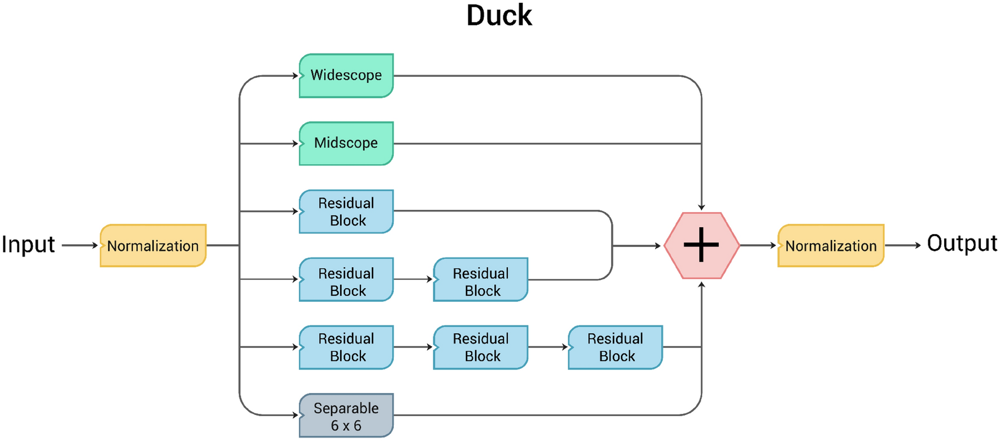
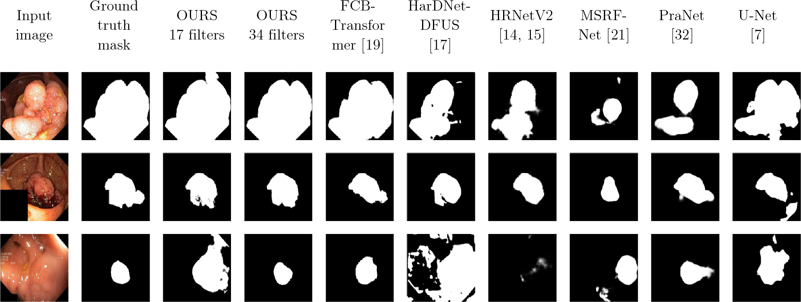

# Using DUCK-Net for polyp image segmentation

[](https://paperswithcode.com/sota/medical-image-segmentation-on-cvc-colondb?p=using-duck-net-for-polyp-image-segmentation)
[](https://paperswithcode.com/sota/medical-image-segmentation-on-etis?p=using-duck-net-for-polyp-image-segmentation)
[](https://paperswithcode.com/sota/medical-image-segmentation-on-kvasir-seg?p=using-duck-net-for-polyp-image-segmentation)
[](https://paperswithcode.com/sota/medical-image-segmentation-on-cvc-clinicdb?p=using-duck-net-for-polyp-image-segmentation)

Authors: [Razvan-Gabriel Dumitru](mailto:razvandumm@gmail.com?subject=[GitHub]DUCK-Net), [Darius Peteleaza](mailto:peteleaza.darius@gmail.com?subject=[GitHub]DUCK-Net) & [Catalin Craciun](mailto:craciun.catalin.c@gmail.com?subject=[GitHub]DUCK-Net)

If you wish to contact any of us for any reason, please use the above click-able email links.

The paper was published in Nature Scientific Reports in ```16 June 2023```.

The detailed paper can be found at https://www.nature.com/articles/s41598-023-36940-5. Please cite our work if you use it.

## DUCK-Net Architecture


## DUCK-Block



A full description of all the components is available in our paper linked above.

## Installation

Our implementation has been tested and run on ```Python 3.10``` using the libraries from ```requirements.txt```.

To install the libraries you can run the command:

```
pip install -r requirements.txt
```

## Running the project

The project can be run using Jupyter Notebook on the file ```ModelNotebook.ipynb```.

## Data-Sets

The randomly split datasets we tested the models on are publicly available [here](https://drive.google.com/drive/folders/1kg9XImzrd9PpTtleQSz6l8uq82LV1sjV?usp=share_link). 

The datasets used in this study are publicly available at: 
- Kvasir-SEG: [here](https://datasets.simula.no/kvasir-seg/). 
- CVC-ClinicDB: [here](https://polyp.grand-challenge.org/CVCClinicDB/). 
- ETIS-LaribpolypDB: [here](https://drive.google.com/drive/folders/10QXjxBJqCf7PAXqbDvoceWmZ-qF07tFi?usp=share_link). 
- CVC-ColonDB: [here](https://drive.google.com/drive/folders/1-gZUo1dgsdcWxSdXV9OAPmtGEbwZMfDY?usp=share_link).

## Results

The results presented in the paper are also avaiable here:

### Kvasir

Method | DSC | Jaccard | Precision | Recall | Accuracy
--- | --- | --- | --- |--- |---
U-Net (with our augmentations) | 0.8655 | 0.7629 | 0.8593 | 0.8718 | 0.9563
HRNetV2 | 0.8530 | 0.7438 | 0.8778 | 0.8297 | 0.9539
PraNet (pre-trained) | 0.9094 | 0.8339 | 0.9599 | 0.8640 | 0.9738
HarDNet-DFUS (pre-trained) | 0.8626 | 0.7584 | 0.9351 | 0.8005 | 0.9583
MSRF-Net | 0.8508 | 0.7404 | 0.8993 | 0.8074 | 0.9543
FCN-Transformer (pre-trained) | 0.9220 | 0.8554 | 0.9238 | 0.9203 | 0.9749
OURS (no pre-training, 17 filters) | 0.9343 | 0.8769 | 0.9350 | 0.9337 | 0.9789
OURS (no pre-training, 34 filters) | **0.9502** | **0.9051** | **0.9628** | **0.9379** | **0.9842**
Standard Deviation (between methods) | 0.0373 | 0.0615 | 0.0349 | 0.0519 | 0.0115

### CVC-ClinicDB

Method | DSC | Jaccard | Precision | Recall | Accuracy
--- | --- | --- | --- | --- | ---
U-Net (with our augmentations) | 0.7631 | 0.6169 | 0.7989 | 0.7303 | 0.9599
HRNetV2 | 0.7776 | 0.6361 | 0.8260 | 0.7346 | 0.9629
PraNet (pre-trained) | 0.8742 | 0.7766 | 0.9608 | 0.8020 | 0.9780
HarDNet-DFUS (pre-trained) | 0.7279 | 0.5723 | 0.8945 | 0.6137 | 0.9586
MSRF-Net | 0.9060 | 0.8282 | 0.9547 | 0.8621 | 0.9842
FCN-Transformer (pre-trained) | 0.9327 | 0.8740 | 0.9728 | 0.8958 | 0.9886
OURS (no pre-training, 17 filters) | 0.9450 | 0.8952 | **0.9488** | 0.9406 | 0.9903
OURS (no pre-training, 34 filters) | **0.9478** | **0.9009** | 0.9468 | **0.9489** | **0.9907**
Standard Deviation (between methods) | 0.0837 | 0.1260 | 0.0622 | 0.1099 | 0.0131

### ETIS-LaribPolypDB

Method | DSC | Jaccard | Precision | Recall | Accuracy
--- | --- | --- | --- | --- | ---
U-Net (with our augmentations) | 0.7984 | 0.6969 | 0.8322 | 0.7724 | 0.9734
HRNetV2 | 0.4720 | 0.3089 | 0.4645 | 0.4797 | 0.9433
PraNet (pre-trained) | 0.8827 | 0.7900 | 0.9825 | 0.8013 | 0.9877
HarDNet-DFUS (pre-trained) | 0.8662 | 0.7640 | 0.9708 | 0.7819 | 0.9869
MSRF-Net | 0.7791 | 0.6382 | 0.9191 | 0.6762 | 0.9797
FCN-Transformer (pre-trained) | 0.9163 | 0.8455 | 0.9633 | 0.8736 | 0.9915
OURS (no pre-training, 17 filters) | 0.9324 | 0.8734 | **0.9539** | 0.9118 | 0.9930
OURS (no pre-training, 34 filters) | **0.9354** | **0.8788** | 0.9309 | **0.9400** | **0.9931**
Standard Deviation (between methods) | 0.1433 | 0.1758 | 0.1620 | 0.1383 | 0.0156

### CVC-ColonDB

Method | DSC | Jaccard | Precision | Recall | Accuracy
--- | --- | --- | --- | --- | ---
U-Net (with our augmentations) | 0.8032 | 0.7037 | 0.8100 | 0.8274 | 0.9807
HRNetV2 | 0.6383 | 0.4687 | 0.5858 | 0.7010 | 0.9565
PraNet (pre-trained) | 0.9131 | 0.8401 | 0.9657 | 0.8659 | 0.9901
HarDNet-DFUS (pre-trained) | 0.7398 | 0.5870 | 0.9500 | 0.6057 | 0.9761
MSRF-Net | 0.8371 | 0.7198 | 0.8603 | 0.8151 | 0.9829
FCN-Transformer (pre-trained) | 0.9073 | 0.8304 | 0.9107 | 0.9040 | 0.9899
OURS (no pre-training, 17 filters) | **0.9353** | **0.8785** | **0.9314** | **0.9392** | **0.9929**
OURS (no pre-training, 34 filters) | 0.9230 | 0.8571 | 0.9113 | 0.9351 | 0.9914
Standard Deviation (between methods) | 0.0986 | 0.1367 | 0.1156 | 0.1099 | 0.0112

### Trained on Kvasir-SEG and tested on CVC-ClinicDB

Method | DSC | Jaccard | Precision | Recall | Accuracy
--- | --- | --- | --- | --- | ---
U-Net (with our augmentations) | 0.7010 | 0.5397 | 0.6640 | 0.7423 | 0.9441
HRNetV2 | 0.7457 | 0.5945 | 0.7642 | 0.7280 | 0.9561
PraNet (pre-trained) | 0.7744 | 0.6319 | 0.9494 | 0.6539 | 0.9638
HarDNet-DFUS (pre-trained) | 0.5784 | 0.4068 | 0.5974 | 0.5605 | 0.9263
MSRF-Net | 0.6763 | 0.5109 | 0.6965 | 0.6572 | 0.9444
FCN-Transformer (pre-trained) | **0.8314** | **0.7114** | 0.8839 | **0.7848** | **0.9719**
OURS (no pre-training, 17 filters) | 0.8014 | 0.6686 | 0.8851 | 0.7321 | 0.9679
OURS (no pre-training, 34 filters) | 0.8211 | 0.6965 | **0.8860** | 0.7650 | 0.9705
Standard Deviation (between methods) | 0.0803 | 0.0975 | 0.1198 | 0.0692 | 0.0150

### Trained on CVC-ClinicDB and tested on Kvasir-SEG

Method | DSC | Jaccard | Precision | Recall | Accuracy
--- | --- | --- | --- | --- | ---
U-Net (with our augmentations) | 0.5369 | 0.3670 | 0.4374 | 0.6951 | 0.8068
HRNetV2 | 0.5531 | 0.3822 | 0.4242 | 0.7944 | 0.7931
PraNet (pre-trained) | 0.6852 | 0.5212 | 0.7647 | 0.6207 | 0.9130
HarDNet-DFUS (pre-trained) | 0.7272 | 0.5714 | 0.9180 | 0.6021 | 0.9261
MSRF-Net | 0.5152 | 0.3469 | 0.3939 | 0.7443 | 0.7742
FCN-Transformer (pre-trained) | **0.8800** | **0.7858** | **0.9659** | 0.8082 | **0.9645**
OURS (no pre-training, 17 filters) | 0.7525 | 0.6032 | 0.6873 | 0.8314 | 0.9119
OURS (no pre-training, 34 filters) | 0.8251 | 0.7023 | 0.7740 | **0.8834** | 0.9396
Standard Deviation (between methods) | 0.1285 | 0.1516 | 0.2121 | 0.0944 | 0.0698

## Qualitative Results

An example of qualitative results can be seen below:



## Model weights

The weights for the models that achieved the final results can be found on [here](https://drive.google.com/drive/folders/1i2-YizsmycWd47rxVMrfZ3GraEA64SDU?usp=sharing) on Google Drive.

## Citation

```
Dumitru, RG., Peteleaza, D. & Craciun, C. Using DUCK-Net for polyp image segmentation. Sci Rep 13, 9803 (2023). https://doi.org/10.1038/s41598-023-36940-5
```

To cite the paper please use the following citation:

### RIS

```
TY  - JOUR
AU  - Dumitru, Razvan-Gabriel
AU  - Peteleaza, Darius
AU  - Craciun, Catalin
PY  - 2023
DA  - 2023/06/16
TI  - Using DUCK-Net for polyp image segmentation
JO  - Scientific Reports
SP  - 9803
VL  - 13
IS  - 1
AB  - This paper presents a novel supervised convolutional neural network architecture, “DUCK-Net”, capable of effectively learning and generalizing from small amounts of medical images to perform accurate segmentation tasks. Our model utilizes an encoder-decoder structure with a residual downsampling mechanism and a custom convolutional block to capture and process image information at multiple resolutions in the encoder segment. We employ data augmentation techniques to enrich the training set, thus increasing our model's performance. While our architecture is versatile and applicable to various segmentation tasks, in this study, we demonstrate its capabilities specifically for polyp segmentation in colonoscopy images. We evaluate the performance of our method on several popular benchmark datasets for polyp segmentation, Kvasir-SEG, CVC-ClinicDB, CVC-ColonDB, and ETIS-LARIBPOLYPDB showing that it achieves state-of-the-art results in terms of mean Dice coefficient, Jaccard index, Precision, Recall, and Accuracy. Our approach demonstrates strong generalization capabilities, achieving excellent performance even with limited training data.
SN  - 2045-2322
UR  - https://doi.org/10.1038/s41598-023-36940-5
DO  - 10.1038/s41598-023-36940-5
ID  - Dumitru2023
ER  - 
```

### BibTeX

```
@article{article,
author = {Dumitru, Razvan-Gabriel and Peteleaza, Darius},
year = {2023},
month = {06},
pages = {},
title = {Using DUCK-Net for polyp image segmentation},
volume = {13},
journal = {Scientific Reports},
doi = {10.1038/s41598-023-36940-5}
}
```
