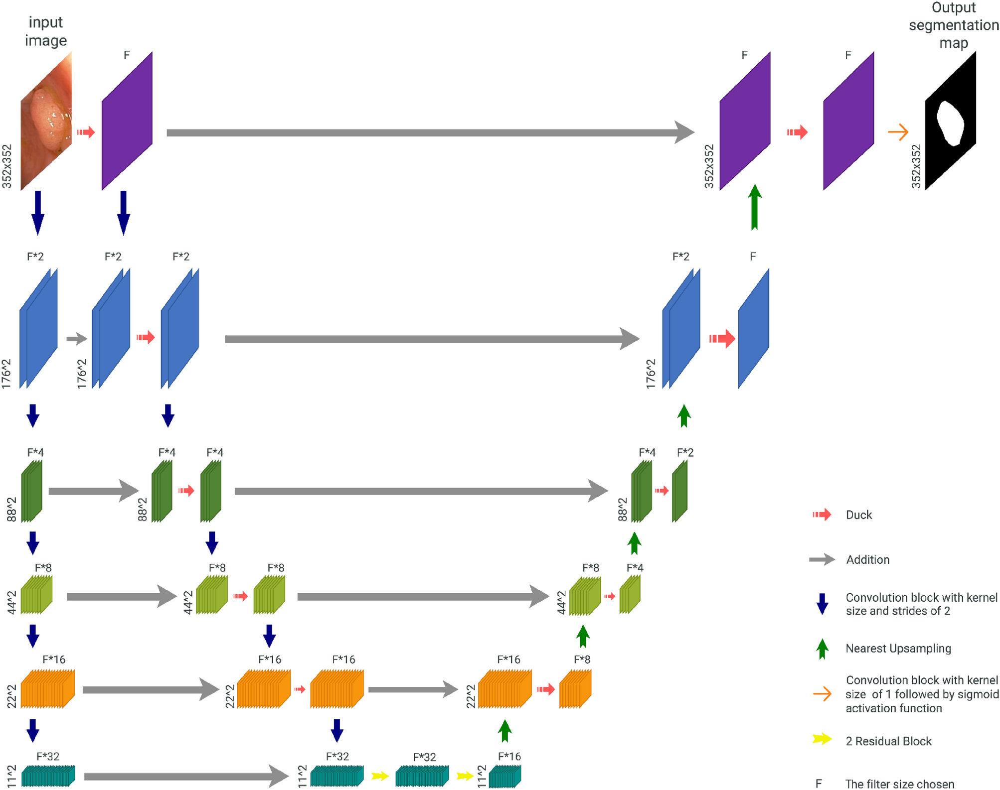

# Using DUCK-Net for polyp image segmentation

Authors: Razvan-Gabriel Dumitru, Darius Peteleaza & Catalin Craciun

The paper was published in Nature Scientific Reports in 16 June 2023.

The detailed paper can be found at https://www.nature.com/articles/s41598-023-36940-5. Please cite our work if you use it.

## DUCK-NET Architecture



## Installation

Our implementation has been tested and run on ```Python 3.10``` using the libraries from ```requirements.txt```.

To install the libraries you can run the command:

```
pip install -r requirements.txt
```
[here]{}
## Pre-trained weights

Several pre-trained weights for the model can be found on here on Google Drive.

## Data-Sets

The randomly split datasets we tested the models on are publicly available [here](https://drive.google.com/drive/folders/1kg9XImzrd9PpTtleQSz6l8uq82LV1sjV?usp=share_link). 

The datasets used in this study are publicly available at: 
- Kvasir-SEG: [here](https://datasets.simula.no/kvasir-seg/). 
- CVC-ClinicDB: [here](https://polyp.grand-challenge.org/CVCClinicDB/). 
- ETIS-LaribpolypDB: [here](https://drive.google.com/drive/folders/10QXjxBJqCf7PAXqbDvoceWmZ-qF07tFi?usp=share_link). 
- CVC-ColonDB: [here](https://drive.google.com/drive/folders/1-gZUo1dgsdcWxSdXV9OAPmtGEbwZMfDY?usp=share_link).

## Results

The results presented in the paper are also avaiable here:

